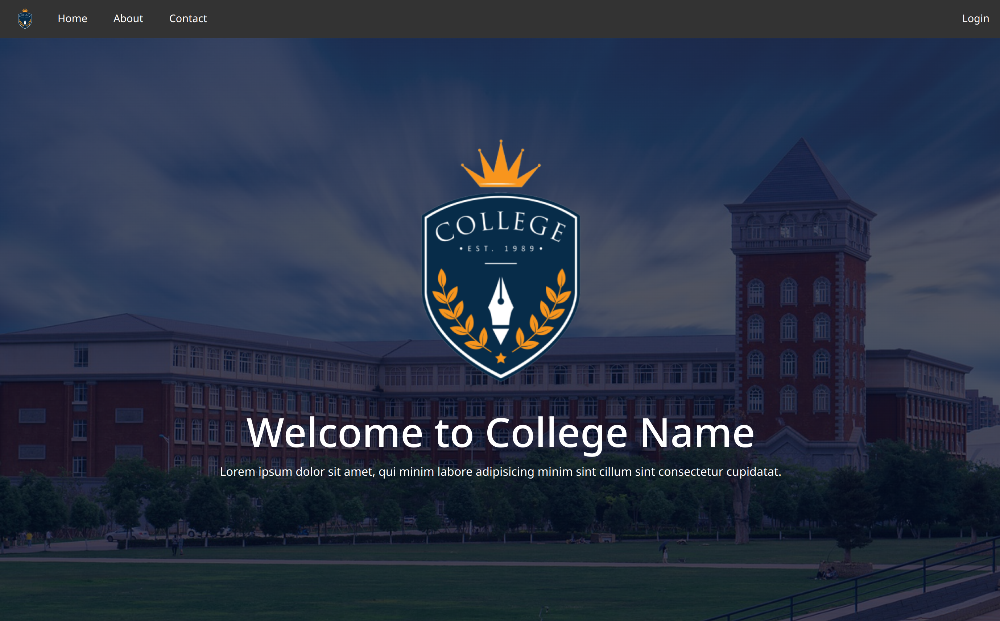
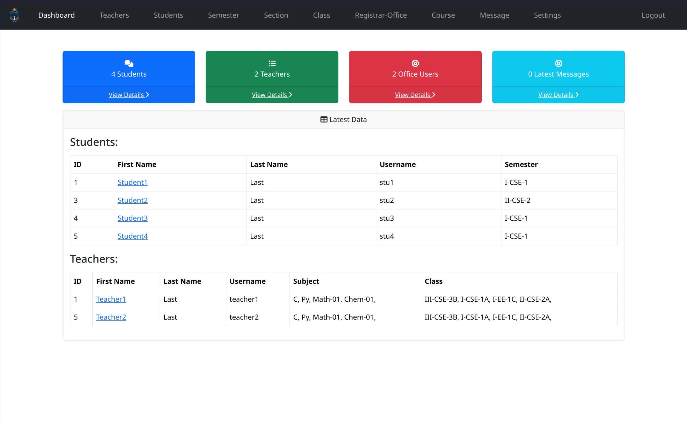

# College Management System
The College Management System is a web application developed in PHP that allows administrators to manage students, courses, and faculty. This system aims to streamline the operations and data management processes of a college.

### Features
- **Admin Panel**: Add, update, delete, students, faculty and registrar office module
- **Student Management**: View student information and results.
- **Faculty Management**: Add new students and mark grades to the students.
- **User Authentication**: Secure login system for administrators.
- **Database Integration**: MySQL database integration for persistent data storage.

## Screenshots


*Homepage*



*Dashboard of the College Management System.*

## Installation

Follow these steps to set up the College Management System on your local machine.

### Prerequisites

- Docker and Docker Compose installed on your machine.

### Steps

1. **Clone the repository**:
    ```bash
    git clone https://github.com/DarkMatter-999/college-management-system.git
    cd college-management-system
    ```

2. **Start the Docker containers**:
    ```bash
    docker-compose up --build
    ```

3. **Access the application**:
   Open your web browser and navigate to `http://localhost:8080`.

## Database Connection Configuration
Ensure your `creds.php` file is correctly configured to connect to the MySQL database:

```php
<?php

    $hostname = "db";
    $username = "root";
    $pass  = "123";
    $db_name = "cms_db";

?>
```

## Admin Panel
- **Login**: The default username for admin is `admin` and default password is `123` for provided database to log in as an administrator.
- **Manage Students**: Navigate to the students section to add, update, or delete student information.
- **Manage Courses**: Navigate to the courses section to add, update, or delete course information.
- **Manage Teachers**: Navigate to the faculty section to add, update, or delete faculty information.
- **Manage Semester**: Navigate to the semester section to add, update, or delete semester.

### Customization
Navigate to the settings section in the admin panel to customize the information according to the user preference.